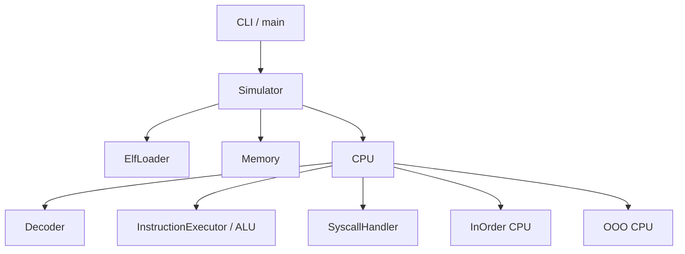
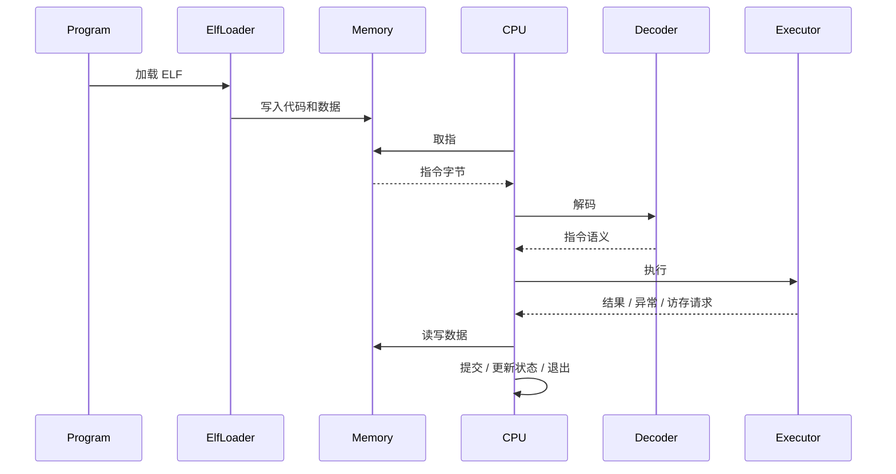
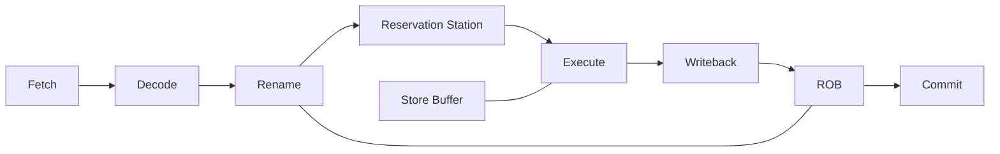

# RISC-V Simulator Architecture

这份文档只回答三件事：

- 核心模块分别放在哪里
- 主执行路径是怎么流动的
- 新功能或 bug 应该优先改哪一层

目标是方便快速建立上下文，不记录实现细节，不和源码注释重复。

## 阅读建议

- 想构建、运行、测什么命令：看 `README.md`
- 想知道模块边界、调用关系、扩展点：看本文件
- 想了解当前重构任务和阶段性决策：看 `tasks/`

## 目录地图

```text
include/
src/
  common/        通用类型、异常、调试辅助
  core/          指令语义、内存、译码、模拟器主协调层
  cpu/
    inorder/     顺序执行 CPU
    ooo/         乱序执行 CPU 及其流水线/队列/缓存组件
  system/        ELF 加载、syscall、tohost 等系统相关能力
tests/           单元测试与组件行为验证
runtime/         最小运行时
programs/        示例程序
tasks/           任务说明、重构计划、执行记录
```

## 分层关系



## 模块职责

- `Simulator`
  统一入口，负责装配组件、加载程序、选择 CPU 模式、驱动运行生命周期。
- `Memory`
  提供统一的线性地址空间与访存边界检查，是取指和数据访问的共同基础。
- `Decoder`
  负责把原始指令转换为可执行语义，压缩指令扩展也应尽量收敛在这一层。
- `InstructionExecutor / ALU`
  放置共享的指令语义与算术逻辑能力，避免 InOrder/OOO 各自维护一套行为。
- `cpu/inorder`
  负责顺序执行路径，强调简单、稳定、便于调试。
- `cpu/ooo`
  负责乱序执行路径，重点在重命名、调度、执行、回写、提交和恢复。
- `system`
  提供 ELF 加载、系统调用、测试环境接口等“程序与模拟器边界”能力。

## 主执行路径



## OOO 关注点



- `OOO` 目录的核心不是“重新实现指令语义”，而是实现时序、依赖、仲裁、恢复。
- 判断一个改动该不该放进 `cpu/ooo/` 的标准：
  如果它解决的是调度、flush、提交一致性、资源竞争，通常属于 OOO。
  如果它解决的是某条指令怎么算、怎么访存、怎么做符号扩展，通常不该只写在 OOO。

## 改代码时的落点规则

- 新增或修复“指令语义”：
  优先放到共享执行层，不要分别补在 InOrder 和 OOO。
- 新增或修复“流水线控制”：
  放到对应 CPU 模式目录，保持控制流和语义层分离。
- 新增或修复“加载、syscall、宿主交互”：
  放到 `system/`。
- 新增或修复“通用类型、异常、调试开关”：
  放到 `common/` 或公共接口层。

## 维护原则

- 单一事实来源：
  模块边界与架构说明以本文件为准。
- 保持精简：
  这里只写稳定结构，不写频繁变化的实现细节。
- 文档跟着重构走：
  只要目录职责或主数据流发生变化，就同步更新本文件。
