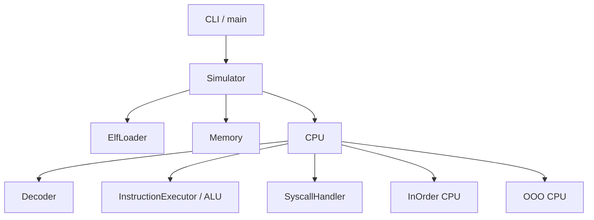
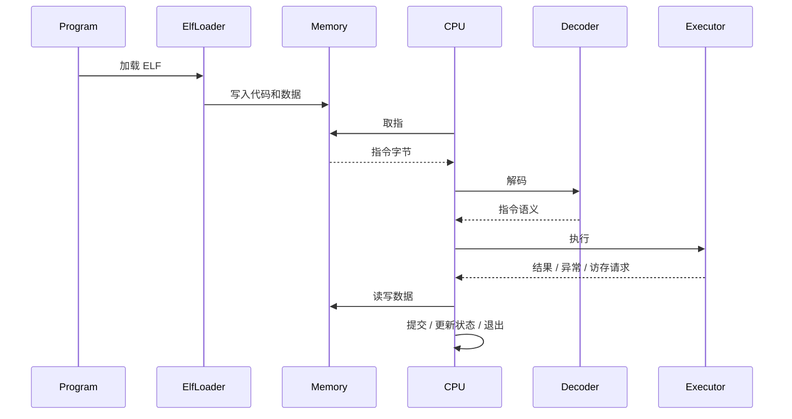
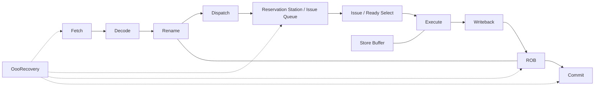
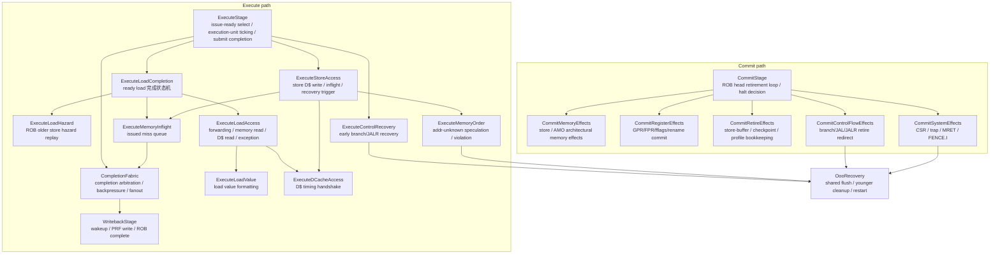

# RISC-V Simulator Architecture

这份文档只回答三件事：

- 核心模块分别放在哪里
- 主执行路径是怎么流动的
- 新功能或 bug 应该优先改哪一层

目标是方便快速建立上下文，不记录实现细节，不和源码注释重复。

## 阅读建议

- 想构建、运行、测什么命令：看 `README.md`
- 想知道模块边界、调用关系、扩展点：看本文件
- 想了解当前重构任务和阶段性决策：看 `tasks/`

## 目录地图

```text
include/
src/
  common/        通用类型、异常、调试辅助
  core/          指令语义、内存、译码、模拟器主协调层
  cpu/
    inorder/     顺序执行 CPU
    ooo/         乱序执行 CPU 及其流水线/队列/缓存组件
  system/        ELF 加载、syscall、tohost 等系统相关能力
tests/           单元测试与组件行为验证
runtime/         最小运行时
programs/        示例程序
tasks/           任务说明、重构计划、执行记录
```

## 分层关系



## 模块职责

- `Simulator`
  统一入口，负责装配组件、加载程序、选择 CPU 模式、驱动运行生命周期。
- `Memory`
  提供统一的线性地址空间与访存边界检查，是取指和数据访问的共同基础。
- `Decoder`
  负责把原始指令转换为可执行语义，压缩指令扩展也应尽量收敛在这一层。
- `InstructionExecutor / ALU`
  放置共享的指令语义与算术逻辑能力，避免 InOrder/OOO 各自维护一套行为。
- `cpu/inorder`
  负责顺序执行路径，强调简单、稳定、便于调试。
- `cpu/ooo`
  负责乱序执行路径，重点在重命名、调度、执行、回写、提交和恢复。
- `system`
  提供 ELF 加载、系统调用、测试环境接口等“程序与模拟器边界”能力。

## 主执行路径



## OOO 关注点



- `OOO` 目录的核心不是“重新实现指令语义”，而是实现时序、依赖、仲裁、恢复。
- `OutOfOrderCPU::step()` 负责装配每个阶段的 `Stage::Context`，阶段执行入口只接收自己的 context，不直接暴露整份 `CPUState`。
- 当某个阶段的 context 仍然需要承载跨领域能力时，优先把稳定规则下沉为更深模块，例如当前的 `ExecuteMemoryOrder` 和 `OooRecovery`，而不是继续扩大 stage interface。
- `OooRecovery` 集中维护乱序流水线恢复时的资源清理规则；触发 recovery 的阶段只负责判断原因、restart PC 或 younger-than 范围。
- 判断一个改动该不该放进 `cpu/ooo/` 的标准：
  如果它解决的是调度、flush、提交一致性、资源竞争，通常属于 OOO。
  如果它解决的是某条指令怎么算、怎么访存、怎么做符号扩展，通常不该只写在 OOO。

### Execute / Commit 模块地图

`ExecuteStage` 和 `CommitStage` 只保留阶段级 orchestration：什么时候推进、什么时候完成、什么时候停止本 cycle。
具体规则下沉到按领域命名的模块里。做性能实验或新增特性时，优先从下面的路径找入口。



#### Execute 路径落点

- 改 load 被阻塞、replay 归因、older store/AMO 判定：
  优先看 `ExecuteLoadHazard`。
- 改 store-to-load forwarding、partial merge、load 从内存或 D$ 得到最终值：
  优先看 `ExecuteLoadAccess`，值格式化规则看 `ExecuteLoadValue`。
- 改 ready load 如何在 replay、cache wait、inflight、exception、complete 之间流转：
  优先看 `ExecuteLoadCompletion`。
- 改 store 执行完成、D$ write、store miss 入 inflight、store 触发 memory-order recovery：
  优先看 `ExecuteStoreAccess`。
- 改 D$ hit/miss/blocking/outstanding/stall counter：
  优先看 `ExecuteDCacheAccess`。
- 改已发出的 load/store miss 如何等待并提交完成事件：
  优先看 `ExecuteMemoryInflight` 和 `CompletionFabric`。
- 改执行完成带宽、completion backpressure、写回 fanout：
  优先看 `CompletionFabric`、`ExecuteStage` 和 `WritebackStage`。
- 改 addr-unknown store speculation、Bad Addr-Unknown Pair、load-store violation recovery trigger：
  优先看 `ExecuteMemoryOrder`。
- 改执行阶段早恢复、branch/JALR younger cleanup、rename checkpoint restore：
  优先看 `ExecuteControlRecovery` 和 `OooRecovery`。
- 改 issue 宽度、执行单元分配、AMO issue wait、load issue speculation：
  优先看 `ExecuteStage`。这一块当前保留在 stage 内，避免为简单调度循环继续制造薄模块。

#### Commit 路径落点

- 改 store / STORE_FP / AMO 退休时的 architectural memory effect：
  优先看 `CommitMemoryEffects`。
- 改整数/浮点寄存器、fflags、rename map 的提交：
  优先看 `CommitRegisterEffects`。
- 改退休后的 store-buffer、rename checkpoint、load/store profile bookkeeping：
  优先看 `CommitRetireEffects`。
- 改 branch/JAL/JALR 退休时的 predictor/profile/redirect flush：
  优先看 `CommitControlFlowEffects`。
- 改 CSR、ECALL、EBREAK、MRET、FENCE.I、trap entry、serializing full flush：
  优先看 `CommitSystemEffects`。
- 改 ROB head commit loop、halt/error 策略、pipeline trace 记录时机：
  优先看 `CommitStage`。

#### Recovery 所有权

- `OooRecovery` 是乱序流水线 flush/reset/younger cleanup 的唯一共享归口。
- `ExecuteControlRecovery`、`ExecuteMemoryOrder`、`CommitControlFlowEffects`、`CommitSystemEffects` 只负责识别 recovery 原因和 restart 信息。
- 后续不要在单个 stage 里新增独立 flush/reset 清理规则；需要新恢复语义时，先扩展 `OooRecovery` request/result，再让触发方调用。

#### 拆分停止线

当前 execute/commit 的模块已经足够支撑可维护性，后续不要因为行数继续机械拆分。
只有满足下面任一条件时，才继续新增模块：

- 一个规则同时被两个以上路径复用，复制会带来一致性风险。
- 一个规则需要独立测试，而且通过 stage 集成测试很难覆盖边界。
- 一个性能实验需要替换或比较不同策略，现有模块没有合适落点。

不满足这些条件时，优先把逻辑留在现有模块或补文档导航。
例如 ALU/FP/BRANCH 的简单 ticking、Completion Fabric 之外的 dispatch loop 基本形状，暂时保留在 `ExecuteStage` 更直观。

### 性能探索入口索引

| 想探索的问题 | 优先入口 |
| --- | --- |
| load 为什么 replay、replay 属于哪一类 | `ExecuteLoadCompletion` / `ExecuteLoadHazard` / `ExecuteMemoryOrder` |
| load 是否应该绕过地址未知 store | `ExecuteMemoryOrder` |
| store-to-load forwarding 命中率、partial merge 行为 | `ExecuteLoadAccess` / `StoreBuffer` / `CommitRetireEffects` |
| D$ miss、outstanding limit、stall 周期 | `ExecuteDCacheAccess` / `ExecuteMemoryInflight` |
| store miss 是否阻塞执行单元或进入 inflight | `ExecuteStoreAccess` / `ExecuteMemoryInflight` |
| branch 早恢复是否减少错误路径工作 | `ExecuteControlRecovery` / `CommitControlFlowEffects` / `OooRecovery` |
| commit 阶段 retire profile 或 architectural state 更新 | `CommitRetireEffects` / `CommitMemoryEffects` / `CommitRegisterEffects` |

## 改代码时的落点规则

- 新增或修复“指令语义”：
  优先放到共享执行层，不要分别补在 InOrder 和 OOO。
- 新增或修复“流水线控制”：
  放到对应 CPU 模式目录，保持控制流和语义层分离。
- 新增或修复“加载、syscall、宿主交互”：
  放到 `system/`。
- 新增或修复“通用类型、异常、调试开关”：
  放到 `common/` 或公共接口层。

## 维护原则

- 单一事实来源：
  模块边界与架构说明以本文件为准。
- 保持精简：
  这里只写稳定结构，不写频繁变化的实现细节。
- 文档跟着重构走：
  只要目录职责或主数据流发生变化，就同步更新本文件。
