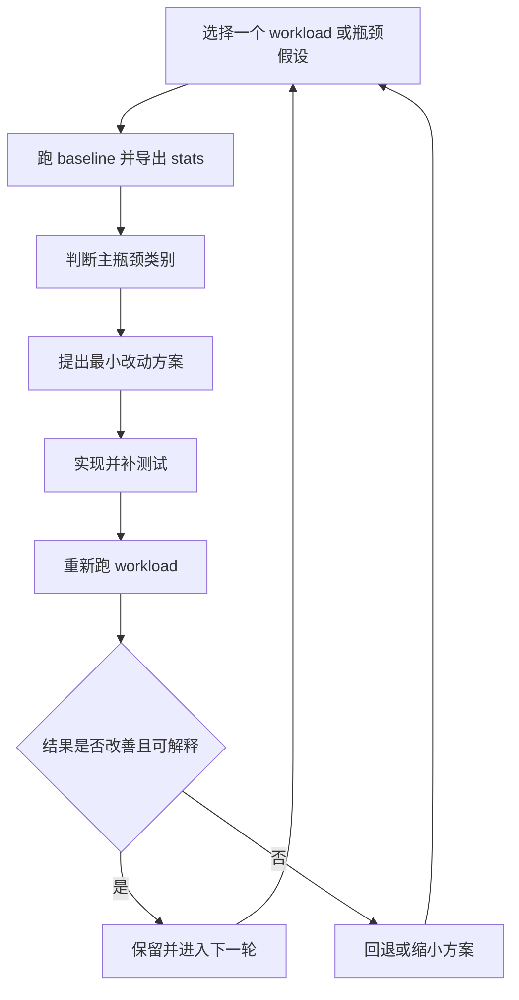

# OOO 性能探索自主迭代草稿

## 背景

当前仓库已经具备以下基础：

- 顺序执行与乱序执行两套 CPU 模式
- 基础 L1 I/D cache、分支预测器、结构化性能计数器
- `CoreMark`、`Dhrystone`、`Embench-IoT`、自定义 LSU / memory 微基准
- 统一 benchmark 执行与结果导出脚本

下一阶段不再把“新增某个微架构特性”本身当成目标，而是要建立一套可持续的性能探索闭环：先通过 workload 与计数器定位瓶颈，再提出假设，再改代码验证，再决定是否继续扩大改动。

## Goal Description

围绕 OOO CPU 建立一条可重复执行的性能探索与验证流程，使后续可以持续评估并迭代以下方向：

- 添加或演进 L2 Cache
- 添加预取器（prefetcher）
- 评估并在条件成熟时扩展到 4 发射
- 在确有收益证据时继续提升分支预测器
- 基于 `CoreMark`、`Dhrystone`、自定义小测试与 memory-learning workload 分析瓶颈，并用代码改动验证结论

最终目标不是一次性把所有方向都实现完，而是形成一个稳定的研究方法：

1. 固定 workload 与运行命令
2. 采集可解释的性能统计
3. 识别主要瓶颈类别
4. 做最小必要改动验证假设
5. 用回归结果决定保留、继续扩展或回退

## 核心问题

这轮自主迭代需要回答的不是“还能加什么特性”，而是下面这些更具体的问题：

- 当前 OOO CPU 的主瓶颈到底主要在前端、分支、执行带宽、提交带宽，还是 memory hierarchy
- `CoreMark`、`Dhrystone` 与 LSU 微基准分别暴露了哪些不同类型的瓶颈
- 在当前代码基础上，优先做 `L2 / prefetcher / 4-issue / BPU` 中的哪一项，单位复杂度收益最大
- 每一轮优化带来的收益是否能被计数器与 workload 行为一致解释，而不是只看单个 IPC 数字

## 工作负载分层

### 1. 整体型 workload

- `CoreMark`
  用来观察综合性吞吐变化，重点看前端、分支、整数执行和 memory 共同作用后的总效果。
- `Dhrystone`
  用来观察小工作集、较强控制流、较低 memory pressure 下的行为，更适合判断分支预测与前端供给问题。

### 2. 可解释微基准

- 现有 `benchmarks/custom/lsu/` 下的 LSU / STREAM 风格微基准
  用来隔离 store forwarding、dependent load、stride、MLP、streaming 行为。
- 用户手写的小测试
  用来快速构造单一瓶颈场景，例如：
  - 高分支密度循环
  - 规则步长顺序访问
  - 跨 cache line 的数组扫描
  - 明确制造 ROB / RS / LSU 压力的指令流

### 3. 扩展型 workload

- `Embench-IoT`
  作为中等规模补充集，用来检查某项优化是否只对单一基准有效。

## 观测与分析要求

后续所有性能探索都必须优先建立“观测面”，不能只凭感觉改结构。

### 基础结果字段

每轮至少要统一记录：

- benchmark 名称
- CPU 模式
- instructions
- cycles
- IPC
- branch_mispredicts
- pipeline_stalls
- stats 文件路径或关键摘要

### 重点观测方向

后续分析应尽量把周期损失映射到下列类别：

- 前端供给不足
  例如 fetch 停顿、I-cache miss、取指重定向开销
- 分支与控制流
  例如 mispredict 次数、恢复代价、BTB/RAS/BHT 命中表现
- 发射与执行带宽
  例如 issue slot 利用率、RS 满、ROB 满、功能单元占用
- 提交与回写限制
  例如 commit 带宽、提交阻塞、长延迟指令拖尾
- 数据缓存与内存层次
  例如 D-cache miss、load replay、store buffer 压力、MLP 不足
- 预取收益与污染
  例如 prefetch 命中、无效预取、带宽占用、副作用

### 需要补强的统计能力

如果现有计数器不能支撑结论，应优先补计数器，再做结构优化。优先级建议如下：

1. Memory / cache / LSU 相关 stall 原因细分
2. Issue / ROB / RS / commit 带宽利用率与饱和次数
3. Branch redirect penalty 与不同预测子模块命中情况
4. 若实现 L2 或 prefetcher，则补对应命中率、请求量、覆盖率、准确率、污染指标

## 迭代方法

每一轮都应遵循以下原则：

- 单轮尽量只验证一个主要假设，避免同时引入多个大特性导致因果关系不清
- 先做能被微基准解释的改动，再看是否能迁移到 `CoreMark` / `Dhrystone`
- 任何收益都要同时看“性能数字”和“计数器变化是否符合预期”
- 若收益只出现在单一 workload，必须分析它是普适优化还是过拟合

## 阶段路线

### Phase 0：基线固化

目标：

- 固定常用 workload、命令行、输出目录结构
- 建立一份可重复的 baseline 结果

建议优先纳入：

- `CoreMark`
- `Dhrystone`
- `memory_learning.json`
- 若干用户手写小测试

交付物：

- 一份 baseline 运行命令集合
- 一份 baseline 结果目录
- 一份“当前主要瓶颈猜测”摘要

### Phase 1：补齐观测面

目标：

- 让每类瓶颈都有足够的统计依据
- 先把“看不见”的成本补可见

优先方向：

- LSU / D-cache stall 原因补细
- issue / ROB / RS / commit 带宽与饱和统计
- branch redirect penalty 的量化

退出条件：

- 对 `CoreMark`、`Dhrystone`、至少一个 memory 微基准，能够用计数器解释主要 stall 来源

### Phase 2：Memory 方向优先探索

目标：

- 在当前路线中优先验证 memory hierarchy 是否是主要收益来源

候选工作：

- 设计 L2 cache 原型
- 设计一个简单、可解释的 prefetcher 原型
- 评估它们对 `stream_copy`、`stream_triad`、`lsu_stride_walk`、`lsu_mlp`、`CoreMark` 的影响

要求：

- L2 与 prefetcher 不必一开始就做复杂模型，应优先做最小可验证版本
- 需要同时观察正收益和副作用，例如污染、带宽竞争、额外延迟

退出条件：

- 能回答“memory 方向是否明显优先于扩大前端/发射宽度”

### Phase 3：4 发射可行性评估与原型

目标：

- 只有在计数器显示现有前端与 memory 不是主瓶颈、且 issue / execute / commit 带宽开始主导时，才推进 4 发射

需要先回答的问题：

- 当前 2 发射是否已经经常打满
- RS、ROB、寄存器重命名、回写端口、提交带宽是否会先成为瓶颈
- 扩大发射宽度后，哪些结构必须同步扩容，哪些可以暂时不改

要求：

- 不接受只把“issue 宽度参数改成 4”作为完成
- 必须明确相关资源配套与回归风险

退出条件：

- 得到“值得继续做 / 暂不值得做”的清晰结论，或落地一个可运行、可测的 4 发射原型

### Phase 4：分支预测器按证据深化

目标：

- 仅在 `Dhrystone`、控制流密集小测试或 `CoreMark` 明确显示分支开销显著时，继续深挖 BPU

候选方向：

- 调整或扩展现有 tournament / local / global / loop 相关机制
- 改善 redirect penalty 的恢复路径
- 增加针对分支热点的 profile 输出

约束：

- BPU 不是默认第一优先级，只有证据显示其为主瓶颈时才提升优先级

## 决策门禁

为了避免任务无限扩散，后续自主迭代必须遵守以下门禁：

- 没有 baseline，不开始大改
- 没有能支撑结论的计数器，不直接引入复杂结构
- 没有微基准解释，不直接宣称某优化对综合 workload 有效
- 没有通过构建、单测和至少一组性能回归，不算完成
- 如果某优化让实现复杂度明显上升但收益不稳定，应允许停止或回退

## 非目标

本轮草稿默认不把以下内容作为主线目标：

- 直接追求可发表级绝对分数
- 引入 SPEC / SimPoint / 多程序混跑等更重基础设施
- 多核、一致性协议、完整 MMU 系统级扩展
- 为了跑分而写难以解释、难以维护的特判逻辑

## 建议输出物

后续每一轮自主迭代都应尽量产出：

- 改动摘要
- 假设与结论
- 受影响 workload 列表
- 关键计数器变化
- 是否继续、回退或转向其他方向的建议

## Path Boundaries

### Upper Bound

在一个完整自主迭代周期内，可以做到：

- 固化 baseline
- 补充关键性能计数器
- 完成至少一个 memory 方向原型（L2 或 prefetcher）
- 对 4 发射给出基于数据的可行性结论，必要时完成最小原型
- 对 BPU 是否继续深入给出基于 workload 的排序建议

### Lower Bound

最低可接受结果不是“新增一个看起来高级的组件”，而是：

- 建立稳定可复现的性能分析流程
- 跑通核心 workload
- 补齐足以定位瓶颈的关键计数器
- 形成下一步该优先做什么的明确结论

### Allowed Choices

- 可以优先做小步快跑、可回退的原型实现
- 可以先做 trend analysis，不强求第一轮就拿到固定百分比收益
- 可以围绕现有 benchmark 基础设施继续扩展脚本、结果汇总、统计输出
- 可以增加专用小测试，只要它们能解释某类瓶颈
- 不应一开始同时并行推进 L2、prefetcher、4-issue、BPU 全部大改
- 不应为了追求好看 IPC 而牺牲可解释性、可维护性和回归稳定性

## Dependencies and Sequence

### Milestones

1. 建立 baseline 与 workload 分层
2. 补齐关键计数器与统计输出
3. 基于 memory-learning 与综合 workload 判断优先方向
4. 优先做 `L2 / prefetcher` 的最小验证
5. 只有在证据支持时再进入 `4-issue` 或更深的 `BPU` 改进

## Implementation Notes

- 后续代码实现不要把文档中的 `Phase`、`Milestone`、`Goal Description` 等计划术语直接带入源码命名
- 优先复用现有 `tools/benchmarks/run_perf_suite.py`、manifest、stats 输出链路
- 如需新增计数器，优先保持命名一致、可批量导出、可被脚本消费
- 每一轮修改后至少执行一次构建、相关单测，以及最小性能回归
- 结果评价以趋势与瓶颈解释一致性为主，不把单个 benchmark 的偶然波动误判为长期收益
