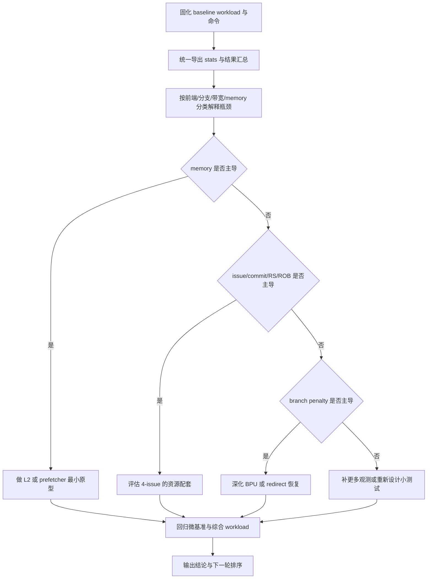

# OOO 性能探索自主迭代计划

## Goal Description

围绕当前仓库中的 OOO CPU，建立一套可重复执行、可回归验证、可被性能计数器解释的性能探索流程，并在此基础上有序推进以下候选优化方向：

- L2 Cache
- 预取器（prefetcher）
- 4 发射可行性评估与原型
- 分支预测器的证据驱动式增强

本计划的核心目标不是一次性完成所有微架构特性，而是把“工作负载选择、基线固化、统计采集、瓶颈判断、最小验证、回归确认”串成稳定闭环。后续每一轮改动都必须能够回答三个问题：

1. 这轮主要针对什么瓶颈假设。
2. 这个假设由哪些 workload 和计数器支撑。
3. 改动后的收益、退化和副作用是否与假设一致。

本计划默认优先使用现有基础设施，包括：

- `tools/benchmarks/run_perf_suite.py`
- `benchmarks/manifest/default.json`
- `benchmarks/manifest/memory_learning.json`
- `benchmarks/custom/lsu/` 下的微基准
- `CoreMark`、`Dhrystone`、`Embench-IoT`
- OOO 现有结构化性能计数器与 stats 输出能力

第一轮自主迭代的范围固定为 `memory-first`：

- 主线只允许围绕 baseline、memory/cache/LSU 观测面、`L2 / prefetcher` 最小原型与对应回归展开。
- 可以补少量非 memory 对照统计，但仅用于排除法判断，不作为独立优化主线。
- `4-issue` 与更深的 BPU 改动默认延期，只有在 memory 路线稳定且证据明确后才进入。

## Acceptance Criteria

遵循 TDD 风格，每条验收标准都需要同时定义正向验证与反向约束，避免“看起来做了很多，但无法判定是否完成”。

- AC-1: 建立稳定的性能分析基线，使后续所有探索都基于同一套 workload、命令与结果格式。
  - Positive Tests (expected to PASS):
    - 能整理出一套固定的 baseline workload 集合，至少覆盖 `CoreMark`、`Dhrystone`、`memory_learning.json` 与至少一个用户自定义小测试。
    - 能使用现有脚本跑出可复现结果，并统一记录 `instructions`、`cycles`、`IPC`、`branch_mispredicts`、`pipeline_stalls` 与 stats 路径。
    - 结果目录和命令格式可被后续迭代直接复用，不依赖手工临时步骤。
  - Negative Tests (expected to FAIL):
    - 只给出“建议可以跑哪些 benchmark”，但没有固定命令、输出路径或结果格式。
    - 只对单一 benchmark 建立 baseline，无法支撑综合 workload 与微基准交叉分析。
    - 结果依赖零散手工记录，后续无法稳定复现。

- AC-2: 补齐足以定位瓶颈的关键观测面，先让主要 stall 原因变得可见，再做结构优化。
  - Positive Tests (expected to PASS):
    - 至少能对前端、分支、发射/执行带宽、提交带宽、LSU/D-cache 这几类瓶颈给出可观测统计项或已有统计映射。
    - 对 `CoreMark`、`Dhrystone`、至少一个 memory 微基准，能输出一份“主要 stall 来源解释”。
    - 若现有计数器不足，计划中明确优先补计数器，而不是直接跳到复杂微架构实现。
  - Negative Tests (expected to FAIL):
    - 只依赖总 IPC 或总 cycles 下结论，没有对应的结构性统计支撑。
    - 计数器只能看总量，无法区分 memory、branch、带宽或前端来源。
    - 在观测面不足时，直接把复杂结构实现视为下一步默认动作。
  - AC-2.1: Memory / cache 相关观测优先级必须高于扩大机器宽度。
    - Positive:
      - 对 `load replay`、`store buffer`、`D-cache miss`、MLP 或相关 stall 分类有明确观测方案。
      - `memory_learning.json` 与 `benchmarks/custom/lsu/` 被当作优先分析集。
    - Negative:
      - 在未判断 memory 是否主导之前，直接优先推进 `4-issue`。

- AC-3: 建立证据驱动的优化优先级排序，优先回答“先做什么最值”而不是“所有方向都做一点”。
  - Positive Tests (expected to PASS):
    - 能基于 baseline 与计数器，给出 `L2 / prefetcher / 4-issue / BPU` 的优先级判断逻辑。
    - 计划明确规定：默认先补观测面，再优先验证 memory hierarchy，最后才在证据支持时推进 4 发射或更深的 BPU。
    - 当某个方向收益不稳定、复杂度高、解释不足时，允许停止、缩小或回退。
  - Negative Tests (expected to FAIL):
    - 同时并行推进 `L2`、`prefetcher`、`4-issue`、`BPU` 四条主线，没有优先级门禁。
    - 用“这看起来是高级特性”替代基于 workload 的收益判断。
    - 一旦某项工作开始，就默认必须做完，不允许证据不足时止损。

- AC-4: Memory 方向必须先以最小可验证原型方式推进，并通过微基准与综合 workload 双重验证。
  - Positive Tests (expected to PASS):
    - 若推进 `L2` 或 `prefetcher`，必须先定义一个简单、可解释、可回退的原型范围。
    - 至少对 `stream_copy`、`stream_triad`、`lsu_stride_walk`、`lsu_mlp` 中的若干 workload 做收益和副作用分析。
    - 若实现了 `L2` 或 `prefetcher`，需要同步规划命中率、请求量、覆盖率、准确率、污染或额外带宽开销等统计。
  - Negative Tests (expected to FAIL):
    - 一上来就设计复杂层次缓存或复杂预取算法，但没有最小原型和验证路径。
    - 只看某个综合 benchmark IPC 提升，不分析微基准上的机理变化。
    - 只记录收益，不记录污染、额外延迟、错误预取等副作用。

- AC-5: 4 发射与 BPU 深化必须是“证据支持后再进入”的后续阶段，而不是默认主线。
  - Positive Tests (expected to PASS):
    - `4-issue` 前置条件中必须包含对 issue slot 利用率、RS/ROB 饱和、回写端口、提交带宽等压力的分析。
    - BPU 深化只在 `Dhrystone`、控制流密集小测试或 `CoreMark` 明确显示分支代价显著时才提升优先级。
    - 对 `4-issue` 的完成定义不能只是把参数改为 4，而必须说明相关配套结构与风险。
  - Negative Tests (expected to FAIL):
    - 在 memory / 前端主瓶颈未厘清时，直接以“扩大宽度”作为默认下一步。
    - 把 BPU 作为默认第一优先级，即使当前路线已明确 memory 更值得先看。
    - 对 `4-issue` 没有资源配套分析，只改一个宽度参数就宣称完成。

- AC-6: 每轮自主迭代都必须以“实现 + 测试 + 性能回归 + 结论摘要”的闭环结束。
  - Positive Tests (expected to PASS):
    - 每一轮都要求至少执行一次构建、相关单测和最小性能回归。
    - 每一轮都需要输出假设、改动摘要、关键计数器变化、收益或退化解释，以及下一步建议。
    - 可以接受“本轮结论是先不做某项优化”这种基于证据的停止结论。
  - Negative Tests (expected to FAIL):
    - 代码已改，但没有构建、没有单测、没有性能回归。
    - 有性能数字，但没有文字化结论与下一步判断。
    - 迭代结束条件只看代码提交完成，不看是否形成可复用结论。

## Path Boundaries

路径边界用于限制范围，避免自主迭代变成无限扩张的微架构大重构。

### Upper Bound (Maximum Acceptable Scope)

在一个完整自主迭代周期内，可以接受的最大范围是：

- 固化 baseline workload、命令与结果输出约定。
- 补齐关键性能计数器与统计导出能力。
- 完成至少一个 memory 方向原型，例如简化版 `L2` 或简单 stride/next-line prefetcher。
- 基于数据给出 `4-issue` 是否值得继续推进的结论，必要时落地最小原型。
- 基于 workload 行为与计数器变化，给出 `BPU` 是否应该继续深化的排序结论。

这个上界强调“形成完整研究闭环”，而不是把所有候选方向都推进到复杂实现。

### Lower Bound (Minimum Acceptable Scope)

最低可接受结果是：

- 跑通固定 baseline workload。
- 建立足以解释主要瓶颈的基本观测面。
- 明确下一阶段优先方向，并给出理由。
- 把“如何判断某项优化值得做”写成可重复执行的方法。

如果最终只有“功能想法清单”，但没有基线、没有统计、没有优先级排序，则不满足最低要求。

### Allowed Choices

- Can use:
  - 现有 benchmark 基础设施、manifest、results 目录和 stats 输出链路。
  - 现有 LSU / memory 微基准作为主要解释性 workload。
  - 小步快跑、可回退的原型实现。
  - 趋势分析，而非第一轮就要求固定百分比收益。
  - 增加新的用户手写小测试，只要它们服务于单一瓶颈解释。
- Cannot use:
  - 在没有 baseline 和统计前提下直接推进复杂微架构大改。
  - 同时把 `L2`、`prefetcher`、`4-issue`、`BPU` 全部作为并行主线。
  - 为了某个 benchmark 分数而引入难以解释、难以维护的特判逻辑。
  - 直接扩展到 SPEC / SimPoint / 多核 / MMU 等更重基础设施，稀释当前目标。

## Feasibility Hints and Suggestions

> 本节是建议性实现路径，不是硬性唯一方案。后续可以根据实际统计结果调整，但必须保持“先观测，再判断，再做最小验证”的顺序。

### Conceptual Approach

建议按以下思路推进：

更具体地说：

1. 先把 baseline 跑法与结果目录稳定下来，避免每一轮都在重新组织实验方法。
2. 优先补 `memory`、`issue/commit`、`branch penalty` 相关观测，让主要周期损失有归因。
3. 先用 `memory_learning.json` 和 LSU 微基准定位 cache/LSU 行为，再去看 `CoreMark`、`Dhrystone` 是否同向受益。
4. 如果 memory 方向收益明显，就先做最小 `L2` 或 prefetcher；如果不是，再去判断机器宽度或 BPU。
5. 每轮都要有“为什么做这轮”与“这轮之后下一步为什么改变或不改变”的结论。

### Relevant References

- [tools/benchmarks/run_perf_suite.py](/Users/yanyue/workspace/claude-test/claude-first/risc-v-simulator/tools/benchmarks/run_perf_suite.py) - 统一 benchmark 执行与结果汇总入口
- [tools/benchmarks/run_memory_learning.sh](/Users/yanyue/workspace/claude-test/claude-first/risc-v-simulator/tools/benchmarks/run_memory_learning.sh) - LSU / memory 学习路线运行脚本
- [benchmarks/manifest/default.json](/Users/yanyue/workspace/claude-test/claude-first/risc-v-simulator/benchmarks/manifest/default.json) - 默认综合 workload 清单
- [benchmarks/manifest/memory_learning.json](/Users/yanyue/workspace/claude-test/claude-first/risc-v-simulator/benchmarks/manifest/memory_learning.json) - memory 学习路线 workload 清单
- [include/cpu/ooo/perf_counter_defs.inc](/Users/yanyue/workspace/claude-test/claude-first/risc-v-simulator/include/cpu/ooo/perf_counter_defs.inc) - OOO 结构化性能计数器定义
- [include/cpu/ooo/cpu_state.h](/Users/yanyue/workspace/claude-test/claude-first/risc-v-simulator/include/cpu/ooo/cpu_state.h) - OOO 状态、cache、BPU 与 perf bank 的聚合点
- [src/cpu/ooo/ooo_cpu.cpp](/Users/yanyue/workspace/claude-test/claude-first/risc-v-simulator/src/cpu/ooo/ooo_cpu.cpp) - OOO 主循环、stats 输出、pipeline flush 与 cache tick 入口
- [src/cpu/ooo/branch_predictor.cpp](/Users/yanyue/workspace/claude-test/claude-first/risc-v-simulator/src/cpu/ooo/branch_predictor.cpp) - 现有 BPU 实现与训练恢复逻辑
- [src/cpu/ooo/cache/blocking_cache.cpp](/Users/yanyue/workspace/claude-test/claude-first/risc-v-simulator/src/cpu/ooo/cache/blocking_cache.cpp) - 当前 L1 cache 功能/时序模型
- [tests/test_perf_counters.cpp](/Users/yanyue/workspace/claude-test/claude-first/risc-v-simulator/tests/test_perf_counters.cpp) - 性能计数器测试入口
- [tests/test_branch_predictor.cpp](/Users/yanyue/workspace/claude-test/claude-first/risc-v-simulator/tests/test_branch_predictor.cpp) - BPU 相关单测
- [tests/test_blocking_cache.cpp](/Users/yanyue/workspace/claude-test/claude-first/risc-v-simulator/tests/test_blocking_cache.cpp) - cache 相关单测
- [tasks/lsu-memory-roadmap.md](/Users/yanyue/workspace/claude-test/claude-first/risc-v-simulator/tasks/lsu-memory-roadmap.md) - 已有 LSU / memory 路线说明

## Dependencies and Sequence

### Milestones

1. Milestone 1: 固化基线与实验入口
   - Phase A: 确认 baseline workload 组合，至少覆盖 `CoreMark`、`Dhrystone`、`memory_learning.json` 与一个用户自定义小测试。
   - Phase B: 固定运行命令、输出目录、结果字段，形成可复用实验模板。
   - Phase C: 产出 baseline 结果摘要，给出第一版瓶颈猜测。

2. Milestone 2: 补齐关键观测面
   - Phase A: 盘点现有 perf counter 与 stats 输出，标出观测盲区。
   - Phase B: 优先补 `memory/cache/LSU`、`issue/commit/RS/ROB`、`branch redirect penalty` 相关统计。
   - Phase C: 用至少三个代表性 workload 写出“主要 stall 来源解释”。

3. Milestone 3: 基于数据确定优先方向
   - Phase A: 对比综合 workload 与微基准，判断主要瓶颈是否偏向 memory hierarchy。
   - Phase B: 形成 `L2 / prefetcher / 4-issue / BPU` 的阶段排序。
   - Phase C: 明确当前不优先推进的方向及原因。

4. Milestone 4: Memory 方向最小验证
   - Phase A: 选定 `L2` 或 prefetcher 作为最小原型。
   - Phase B: 同步补足该原型所需的命中率、覆盖率、请求量或污染统计。
   - Phase C: 在微基准与综合 workload 上完成回归并总结收益与副作用。

5. Milestone 5: 进入后续深挖或止损
   - Phase A: 若 memory 方向收益明确，决定继续扩展还是收敛。
   - Phase B: 若 memory 方向没有明显大问题且收益趋于稳定，再评估 `4-issue` 的资源约束与实现门槛。
   - Phase C: 仅当 branch penalty 显著时，再进入 BPU 深化。

依赖关系必须满足：

- `Milestone 2` 依赖 `Milestone 1`，因为没有 baseline 就无法评估统计是否足够。
- `Milestone 3` 依赖 `Milestone 2`，因为没有观测面就无法做优先级排序。
- `Milestone 4` 依赖 `Milestone 3`，因为原型方向必须由数据驱动而不是主观挑选。
- `Milestone 5` 依赖 `Milestone 4`，因为后续是否扩展或切换方向，取决于最小验证的真实结果。

## Task Breakdown

每个任务必须有且仅有一个路由标签：

- `coding`: 由 Claude 直接实现
- `analyze`: 通过 Codex 执行分析或评审

第一轮 RLCR 范围锁定：

- 允许进入 `coding` 的主线任务，只能是 baseline 固化、memory/cache/LSU 观测补强、memory 原型实现与其测试。
- 非 memory 方向在第一轮只能做只读分析，不得实现 `4-issue` 或更深的 BPU 改动。
- 只有当 memory 方向经过回归验证“没有明显大问题”后，后续轮次才允许把 `4-issue` 升级为 `coding` 任务。

| Task ID | Description | Target AC | Tag (`coding`/`analyze`) | Depends On |
|---------|-------------|-----------|----------------------------|------------|
| task1 | 固化 baseline workload、运行命令与输出目录约定 | AC-1 | coding | - |
| task2 | 盘点现有 perf counters、stats 输出与观测盲区 | AC-2 | analyze | task1 |
| task3 | 补齐 memory/cache/LSU 相关关键统计与测试 | AC-2, AC-4 | coding | task2 |
| task4 | 补最小必要的非 memory 对照统计，仅用于排除法判断 issue/commit/branch 是否主导 | AC-2, AC-3 | coding | task2 |
| task5 | 用 `CoreMark`、`Dhrystone`、memory 微基准做第一轮 memory-first 瓶颈归因报告 | AC-2, AC-3 | analyze | task3 |
| task6 | 给出 `L2 / prefetcher` 的第一轮优先级排序与最小原型选择 | AC-3, AC-4 | analyze | task5 |
| task7 | 实现 memory 方向最小原型并补充对应统计 | AC-4 | coding | task6 |
| task8 | 在微基准与综合 workload 上做 memory 路线回归并汇总结论 | AC-4, AC-6 | analyze | task7 |
| task9 | 判断 memory 路线是否“没有明显大问题”，并决定继续扩展、收敛或停止 | AC-4, AC-6 | analyze | task8 |
| task10 | 在 task9 明确通过后，评估是否把 `4-issue` 升级为下一阶段任务 | AC-5, AC-6 | analyze | task9 |
| task11 | 仅在 branch penalty 仍显著时，评估是否把 BPU 深化列为后续主线 | AC-5, AC-6 | analyze | task9 |

## Claude-Codex Deliberation

### Agreements

- 当前阶段更需要“性能探索闭环”，而不是“堆叠高级特性清单”。
- `memory_learning` 路线与 LSU 微基准是当前最适合作为解释性 workload 的入口。
- `L2 / prefetcher` 的优先级应默认高于 `4-issue`，除非计数器明确显示带宽结构才是主瓶颈。
- `4-issue` 和 BPU 深化都必须以后验数据驱动，而不是预设为下一步必做。

### Resolved Disagreements

- 是否需要在计划中写死收益百分比目标：
  选择不写死固定百分比，只要求趋势可解释、回归稳定、优先级明确。
  原因是当前阶段重点是建立方法论和观测面，而不是提前承诺不现实的硬指标。

- 是否应把 BPU 作为默认第一主线：
  选择否。
  原因是现有路线文档与微基准基础更偏向 LSU / memory，且草稿已明确“已确定先不继续深挖 BPU，除非证据支持”。

### Convergence Status

- Final Status: `converged`

## Pending User Decisions

- 当前无新的阻塞性用户决策。
- 已确认决策：
  - DEC-1: 第一轮只聚焦 memory 方向；待 memory 路线没有明显大问题后，再进入 `4-issue`

## Implementation Notes

### Code Style Requirements

- 实现代码与注释中不得出现 `AC-`、`Milestone`、`Phase`、`Step` 等计划术语。
- 代码命名应使用领域语义命名，例如 `l2_hit_count`、`prefetch_coverage`、`issue_stall_cycles`，不要使用文档性编号。
- 优先复用现有 OOO 统计链路、benchmark 脚本和 manifest，不要重复造新的并行运行框架。
- 任何新增性能计数器都应尽量满足：
  - 命名稳定
  - 可序列化导出
  - 可被脚本消费
  - 能与具体瓶颈类别建立映射
- 每轮实现完成后，至少执行：
  - 一次构建
  - 相关单测
  - 一组最小性能回归
- 代码提交前应明确区分：
  - 功能正确性验证
  - 性能趋势验证
  - 结论是否可解释
- 第一轮执行约束：
  - 不得把 `4-issue` 或更深的 BPU 改动作为实现目标。
  - 若为了 memory 归因需要补充 issue/commit/branch 对照统计，应控制在“观测补强”范围内，不得演化为并行优化主线。
  - 只有当 task9 明确给出“memory 路线没有明显大问题”的结论后，后续计划才允许进入 `4-issue` 相关实现。
