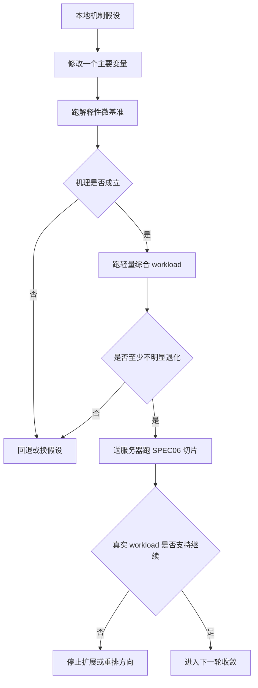

# Prefetch 收敛设计

日期：2026-04-10

## 背景

当前仓库已经完成 OOO L1D next-line prefetch 原型、A/B 开关和基础统计导出。现有 round2 结果表明：

- `stream_copy`、`stream_triad`、`lsu_stride_walk` 是明确正收益样本。
- `coremark`、`dhrystone` 只表现出极小幅度改善，不足以支撑“prefetch 已经明显成熟”的判断。
- `lsu_mlp` 暴露出严重的无效预取与污染问题，说明当前 next-line 策略还不具备在多流场景下的可控性。

因此，下一阶段的主问题不是“要不要继续加新特性”，而是：

1. 是否能把 prefetch 从“在部分样本上有效”推进到“在负样本上也可控”。
2. 是否应继续沿着 next-line 机制收敛，还是引入一个更轻量但证据更强的候选触发方式。
3. 在真实 workload 覆盖不足的前提下，如何让本地小测试与服务器 SPEC06 切片形成互补闭环。

## 目标

下一阶段固定为 `prefetch convergence`，目标按优先级排列如下：

1. 压制 `lsu_mlp` 类负样本中的无效预取和 cache pollution。
2. 尽量保留 `stream_copy`、`stream_triad`、`lsu_stride_walk` 这类顺序访问样本中的已有正收益。
3. 让 `CoreMark`、`Dhrystone` 至少不出现明显回退。
4. 把本地解释性 workload 与服务器 SPEC06 切片组织成统一的阶段门禁。

本阶段的成功标准不是“把 prefetch 做复杂”，而是“把 prefetch 做得更可控、可解释、可止损”。

## 非目标

本阶段明确不做以下工作：

- 启动 `4-issue` 实现。
- 启动 `non-blocking L1D` 实现。
- 把 `L2` 升级为并行主线。
- 大改 LSU 主时序、load replay 主机制、store buffer 主仲裁。
- 引入复杂的大型表驱动预取器。
- 依赖单一综合 workload 分数直接下结论。

说明：
`non-blocking L1D` 与 `4-issue` 后续都可能成为重要方向。当前顺序应调整为：

1. 先完成 `prefetch convergence`
2. 再评估或实现 `non-blocking L1D` 的最小原型
3. 最后才评估 `4-issue`

原因是当前 D-cache 仍是轻量 `blocking cache` 模型，真实的 memory-level parallelism 还没有被充分表达。如果在此之前直接进入 `4-issue`，收益很可能被后端 memory 阻塞掩盖，也难以归因。

## 阶段排序

下一阶段相关方向的推荐排序固定为：

1. `prefetch convergence`
2. `non-blocking L1D feasibility / minimal prototype`
3. `4-issue feasibility`

排序理由：

- `prefetch convergence` 用于在当前模型下先完成止血、门禁固化和真实性外环接通。
- `non-blocking L1D` 比 `4-issue` 更基础，因为它直接决定 memory 并发能力是否被 cache 模型压死。
- `4-issue` 只有在 memory 路线不再是第一主矛盾时，才值得升级为主线。

## 方案选择

本阶段采用“双轨收敛”方案：

- 主线方案：收敛现有 `next-line prefetch`
  重点是 `gating`、`throttling`、污染控制和统计补强。
- 候选方案：一个轻量的新触发机制
  重点不是复杂度，而是“比纯 next-line 多一层触发证据”，例如连续 miss 证据、简单 stride 证据、或轻量 confidence 规则。

约束：

- 两条线必须共用同一套 workload、同一套结果口径和同一套 gate。
- 任一候选机制都必须保持 `可关、可测、可回退`。
- 任何单轮实验只允许改变一个主要机制变量，避免因果污染。

## 风险

### 风险 1：压住负样本时把正样本收益一并抹掉

如果 gating/throttling 过强，`stream_copy`、`stream_triad`、`lsu_stride_walk` 的收益会被误伤。

对应要求：

- 不能只看 `unused_evictions` 下降。
- 必须同时看 `useful_hits`、load stall、IPC/cycles 是否仍然保住。

### 风险 2：同时改太多变量，导致结论失真

宽范围探索下，如果同一轮里同时改 next-line gating、新触发机制和 workload 参数，最终很难归因。

对应要求：

- workload、命令、输出口径固定。
- 统计扩展与机制改动尽量拆开验证。
- 同一轮只允许一个主要机制变化。

### 风险 3：统计更漂亮，但真实收益并未改善

例如 `prefetch_requests` 降了，但只是因为发得更少；`useful_hits` 升了，但 load stall 没改善。

对应要求：

- 统计必须和 `cycles`、`ipc`、`l1d_stall_cycles_load` 联合解释。
- 不能只用一个 proxy 指标判定成功。

### 风险 4：当前 cache 模型导致机制优劣被放大或扭曲

当前 L1D 是轻量 `blocking cache` 模型，prefetch 在 miss 路径里直接安装 cache line。某些策略可能在该模型下显得更好或更差。

对应要求：

- 明确区分“在当前模型下更好”和“机制本身更合理”。
- 本地解释性 workload 只作为内环，不直接替代真实 workload 结论。

### 风险 5：小测试不足导致过拟合

仅靠现有正负样本，容易把优化做成“只对自己写的测试好看”。

对应要求：

- 必要时新增 1 到 2 个中间态解释性小测试。
- 服务器 SPEC06 切片必须进入阶段 gate，承担真实性校验职责。

## 验证方式

### 三层验证闭环

### 第一层：解释性微基准

核心 workload：

- `stream_copy`
- `stream_triad`
- `lsu_stride_walk`
- `lsu_mlp`

必要时允许新增 1 到 2 个解释性 workload，但必须服务于当前 prefetch 收敛问题，例如：

- 弱 stride / 间歇顺序访问
- 多流但低冲突访问
- burst + 间歇跳转访问

本层目标：

- 验证 useful hit 是否集中在真正有价值的场景。
- 验证 unused eviction 是否明显下降。
- 验证 `lsu_mlp` 类负样本是否收敛。
- 验证 `stream_*` / `stride_walk` 正样本收益是否基本保住。

### 第二层：轻量综合 workload

核心 workload：

- `CoreMark`
- `Dhrystone`

本层目标：

- 不要求一定有明显提升。
- 至少不允许出现系统性回退。
- 统计变化必须与微基准层结论同向，不允许出现明显矛盾。

### 第三层：真实外环 gate

平台：

- 服务器上的 SPEC06 切片

本层目标：

- 做候选方案排序，而不是高频调参。
- 检查本地机制结论是否能迁移到更真实的 workload。
- 决定该 prefetch 路线是否值得继续投入，或是否该把优先级交给别的方向。

## 关键指标

### 收益指标

- `ipc`
- `cycles`
- `l1d_misses`
- `l1d_stall_cycles_load`
- `l1d_stall_cycles_store`

### 预取质量指标

- `l1d_prefetch_requests`
- `l1d_prefetch_issued`
- `l1d_prefetch_useful_hits`
- `l1d_prefetch_unused_evictions`
- `l1d_prefetch_dropped_already_resident`

### 保护性指标

- `CoreMark`、`Dhrystone` 不明显退化
- 本地微基准机理解释与综合 workload 方向不矛盾
- 复杂度保持在可随时回退的水平

## Coding Gate

### 允许的改动

- 现有 `next-line prefetch` 的 `gating`
- 现有 `next-line prefetch` 的 `throttling`
- 一个轻量候选触发机制
- 与上述机制直接相关的统计补强
- 1 到 2 个服务于本问题的解释性小 workload

### 禁止的改动

- 启动 `4-issue` 实现
- 启动 `non-blocking L1D` 实现
- 将 `L2` 升级为并行主线
- 大改 LSU 主时序
- 大改 load replay 主机制
- 大改 store buffer 主仲裁
- 引入复杂的大型 predictor/table 预取器

### 本地通过条件

- `lsu_mlp` 类负样本必须显著收敛，不能继续出现“几乎发多少浪费多少”的状态。
- `stream_copy`、`stream_triad`、`lsu_stride_walk` 的主要正收益不能被明显抹掉。
- `CoreMark`、`Dhrystone` 至少不出现明显回退。
- 统计变化必须能被清楚解释。

### 服务器通过条件

- SPEC06 切片整体不存在系统性回退。
- 至少部分真实 workload 出现与本地机理分析一致的改善或风险收敛。
- 若本地结论与 SPEC06 明显冲突，应优先相信真实 workload，停止继续扩展当前方案。

## 决策规则

下一阶段的路线判断遵循以下顺序：

1. 若 prefetch 收敛后，负样本仍明显失控，则停止扩大 prefetch 复杂度，优先止损或转向。
2. 若 prefetch 收敛后，正样本收益保住且真实 workload 没有明显回退，则进入 `non-blocking L1D feasibility / minimal prototype` 阶段。
3. 若 `non-blocking L1D` 完成最小验证后，真实 workload 仍显示 memory 路线收益有限，而 issue/commit/ROB 压力明显，则再把 `4-issue` 升级为后续候选主线。

## 后续阶段接口

本阶段结束时，必须额外回答下面两个问题，供下一份 spec 直接承接：

1. `non-blocking L1D` 是否已经具备被正式立项的证据
   需要结合：
   - 服务器 SPEC06 切片中 memory 相关 stall 的持续性
   - 本地多流 workload 在 blocking 模型下的解释局限
   - 当前 prefetch 收敛后是否仍然被 blocking miss 模型压制

2. `4-issue` 是否仍应保持 analyze-only
   默认答案应为“是”，除非：
   - prefetch 收敛已经完成
   - `non-blocking L1D` 已经评估过或最小实现过
   - 真实 workload 显示 issue/commit/ROB 压力已经比 memory 问题更主导

## 输出物

本阶段每一轮都必须形成以下产物：

- 改动摘要
- 假设与结论
- 核心 workload 列表
- 关键统计变化
- 是否继续、回退或切换方向的建议

## 相关参考

- [tasks/memory-first-round2-prefetch-report.md](/Users/yanyue/workspace/claude-test/claude-first/risc-v-simulator/tasks/memory-first-round2-prefetch-report.md)
- [docs/plan.md](/Users/yanyue/workspace/claude-test/claude-first/risc-v-simulator/docs/plan.md)
- [benchmarks/custom/lsu/lsu_mlp.c](/Users/yanyue/workspace/claude-test/claude-first/risc-v-simulator/benchmarks/custom/lsu/lsu_mlp.c)
- [src/cpu/ooo/cache/blocking_cache.cpp](/Users/yanyue/workspace/claude-test/claude-first/risc-v-simulator/src/cpu/ooo/cache/blocking_cache.cpp)
- [include/cpu/ooo/cache/blocking_cache.h](/Users/yanyue/workspace/claude-test/claude-first/risc-v-simulator/include/cpu/ooo/cache/blocking_cache.h)
