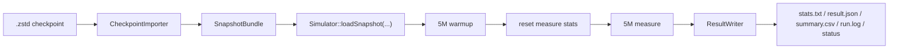

# SPEC06 单切片恢复与性能评估设计

## 背景

当前仓库已经具备两类能力：

- 直接加载 ELF 并运行顺序 / OOO 模拟。
- 通过 `tools/benchmarks/run_perf_suite.py` 对本地 benchmark 产出 `stats/csv/json`。

但仓库还不具备以下能力：

- 从 SPEC06 的 `.zstd` checkpoint 恢复架构态后继续执行。
- 用“warmup 窗口 + measure 窗口”的方式评估切片性能。
- 在切片未跑满目标窗口时，明确区分失败原因并把原因落盘。

用户当前阶段目标不是立即支持完整 `0.3c` 并行批跑，而是先打通“单个 SPEC06 切片恢复并评估性能”的主路径，为后续扩展到 `0.3c` runner 做基础。

## 用户确认的范围

- 用户期望的直接目标输入：单个 `.zstd` checkpoint 文件路径。
- 第一阶段默认窗口：`5M warmup + 5M measure`。
- 停止条件：按“指令数窗口”停止，而不是按周期数停止。
- 成功条件：完整跑满 `5M warmup + 5M measure`。
- 失败条件：未跑满目标窗口就提前停止。
- 失败时必须暴露原因，至少能看出是非法指令、未实现系统态指令、trap、主动退出、其他 halt。
- 第一阶段允许依赖外部 restorer / 转换器，但模拟器内部接口不能和外部工具强耦合。
- 默认输出不仅要有 `stats.txt`，还要有结构化结果、日志、状态标记目录，方便后续平滑扩成 `0.3c` 批量执行。
- 结合目录格式核查后的实现契约：第一阶段运行入口应接受 `checkpoint + recipe`，不能假设裸 `.zstd` 自带完整运行上下文。

## 参考事实

对比 GEM5 现有链路，可以确认以下事实：

- GEM5 的 SPEC06 workflow 采用“`checkpoint_list` 选择 workload + `checkpoint_root` 定位真实 checkpoint + 每任务独立输出目录 + 后处理聚合”的骨架。
- `checkpoint.lst` / `spec06_0.3c.lst` 的 6 列格式是：
  `workload_name checkpoint_path skip fw dw sample`
- 但当前 GEM5 的 `parallel_sim.sh` 实际只使用前两列来定位 `.zstd` 文件，后四列没有继续传给 gem5 主流程。
- 说明第一阶段不需要照搬 workload list 的全部语义，可以直接把 `5M warmup + 5M measure` 作为当前项目自己的显式运行口径。
- 用户给出的 gcc15 SPEC06 checkpoint 根目录本身就带有 `checkpoint.lst` 和 `cluster-0-0.json`，因此后续扩展到 `0.3c` 时可以优先复用 checkpoint 仓库自带元数据，而不是额外依赖一套外部 list。
- 单个 `.zstd` checkpoint 不是自描述容器。仅靠文件本身无法稳定拿到 workload 启动命令、输入文件集合、完整权重精度以及“它是否属于正式纳入的有效切片”。
- checkpoint 根目录中存在“文件系统里存在但未被 `checkpoint.lst` / `cluster-0-0.json` 引用”的点，因此未来批量模式不能简单依赖目录扫描结果，必须优先信任 list/json 元数据。

## 方案选择

最终采用分层适配方案，而不是“模拟器直接读取 `.zstd`”或“完全依赖外部脚本”。

### 被采纳方案

引入两层能力：

1. `Checkpoint Import Layer`
   - 输入：单个 `.zstd` checkpoint。
   - 职责：通过外部 restorer / 转换器，把 checkpoint 转成项目内部定义的标准化快照。
2. `Simulator Restore + Measure Layer`
   - 输入：标准化快照。
   - 职责：恢复模拟器架构态，执行 `5M warmup + 5M measure`，并产出统计、状态与失败原因。

### 不采用的方案

- 不直接让模拟器第一版原生解析 `.zstd` 格式。
  原因：当前仓库没有 checkpoint 恢复主路径，直接吃透压缩格式和 GCPT/GCB 细节会把第一阶段范围拉得过大。
- 不把恢复逻辑全部放在外部脚本中。
  原因：这样后续很难在项目内部统一做失败归因、结果结构化和批量 runner 复用。

## 总体设计



### 核心原则

- 模拟器内部只恢复“架构态”，不要求 checkpoint 导入时携带微架构态。
- cache / predictor / pipeline 等微架构热身通过 `warmup` 窗口自然建立。
- checkpoint 外部格式与模拟器内部恢复格式之间必须隔一层稳定接口，避免后续替换 restorer 时侵入内核代码。
- 单切片 runner 的目录结构、状态标记和结构化输出从第一版就统一好，保证未来可直接扩展为批量 runner。

## 模块边界

### 1. CheckpointImporter

职责：

- 校验 checkpoint 文件路径与后缀。
- 调用外部 restorer / 转换器，或接入预定义适配器。
- 将导入结果转换为统一的 `SnapshotBundle`。
- 如果导入失败，返回明确的导入阶段错误，而不是把失败推迟到执行阶段。

要求：

- 第一版允许通过命令行显式指定 importer / restorer 路径。
- importer 输出要与具体外部工具解耦，模拟器只消费内部结构。
- 若 checkpoint 已内嵌 restorer 信息，也允许 importer 走“无需外部 restorer”的路径。

### 2. SnapshotBundle

这是项目内部的标准化快照格式，最少需要包含：

- `pc`
- `integer_regs`
- `memory image` 或分段内存页
- `memory layout metadata`
- `isa / xlen / enabled extensions`
- `checkpoint metadata`
  - benchmark 名
  - slice id
  - weight
  - 原始 checkpoint 路径
- `run recipe metadata`
  - workload 启动定义来源
  - 若可获得，则记录 binary / argv / 输入描述
- `optional system state`
  - 如果 restorer 能提供，则保留 CSR / privilege / trap 相关状态

设计要求：

- 字段分为“必需字段”和“可选字段”。
- 第一版只要求支持当前单核 SPEC06 切片所需的最小架构态。
- 快照结构可以先落成项目内的中间文件格式，也可以在内存中构建，但对模拟器暴露的 API 必须一致。

### 3. Simulator Restore API

需要新增一条独立于 ELF 加载的恢复主路径，例如：

- `loadSnapshot(...)`
- `restoreFromSnapshot(...)`

职责：

- 清理当前模拟器状态。
- 按快照恢复内存、PC、寄存器和必要系统态。
- 准备运行窗口控制器。
- 在 warmup 结束时重置测量统计，但不破坏架构执行状态。

约束：

- 不能复用“ELF 从头启动”的假设，例如默认栈初始化、入口地址初始化等逻辑不能误伤 checkpoint 恢复流程。
- OOO 和 InOrder 都应走统一恢复入口；若第一阶段仅保证 OOO 可用，也要把接口设计成模式无关。
- 若恢复执行依赖额外 run recipe，恢复 API 必须显式接收并校验，而不是假设 checkpoint 自带全部运行上下文。

### 4. WindowRunner

职责：

- 统一管理 `warmup instructions` 与 `measure instructions` 两段窗口。
- 在 warmup 窗口结束时触发统计重置。
- 在 measure 窗口完成时返回成功状态。
- 如果在任意阶段提前停止，返回失败状态和停止原因。

第一阶段默认值：

- `warmup_insts = 5_000_000`
- `measure_insts = 5_000_000`

后续可扩展字段：

- 从命令行覆写 warmup / measure。
- 从 metadata 或 workload list 读取窗口。

### 5. ResultWriter

职责：

- 写文本 stats。
- 写结构化 `result.json`。
- 维护汇总用的 `summary.csv` 行。
- 写状态文件，如 `completed` / `abort`。
- 保存运行日志与错误摘要。

第一阶段建议目录形态：

```text
<output-root>/
  run.log
  stats.txt
  result.json
  summary.csv
  completed | abort
  error.txt
```

当未来扩成批量模式时，可自然变为：

```text
<output-root>/<task-name>/
  run.log
  stats.txt
  result.json
  completed | abort
  error.txt
```

## 数据流

### 成功路径

1. 用户传入单个 `.zstd` checkpoint 路径。
2. CLI 构造 `CheckpointRunConfig`。
3. `CheckpointImporter` 生成 `SnapshotBundle`。
4. `Simulator` 从 `SnapshotBundle` 恢复架构态。
5. `WindowRunner` 先执行 `5M warmup`。
6. warmup 到达上限后，重置测量统计。
7. 继续执行 `5M measure`。
8. measure 跑满即判定成功。
9. `ResultWriter` 落盘 stats、json、csv、日志与 `completed` 标记。

### 失败路径

1. 导入阶段失败：
   - checkpoint 不存在
   - restorer 不可用
   - 转换器退出非零
   - 快照字段缺失
2. 恢复阶段失败：
   - 快照与模拟器内存模型不兼容
   - 恢复所需关键状态缺失
3. 运行阶段失败：
   - 非法指令
   - 未实现系统态指令
   - trap / exception
   - 主动退出
   - 其他 halt
   - 未跑满 `warmup + measure`

失败时必须在 `result.json` 和 `error.txt` 中显式给出：

- 失败阶段
- 失败类型
- 人类可读错误消息
- 终止时的 PC / 指令数 / 周期数

## CLI 设计

第一阶段建议新增一组与 ELF 运行路径分离的参数：

- `--checkpoint=PATH`
- `--checkpoint-recipe=PATH`
- `--checkpoint-importer=NAME`
- `--checkpoint-restorer=PATH`
- `--warmup-instructions=N`
- `--measure-instructions=N`
- `--checkpoint-output-dir=DIR`
- `--checkpoint-summary-csv=FILE`

第一阶段默认行为：

- `--checkpoint` 出现时走 checkpoint 恢复路径，不走 ELF 加载路径。
- `--checkpoint-recipe` 在第一阶段视为必需输入，除非 importer 能证明该 checkpoint 已自带完整运行上下文。
- `warmup` 默认 `5_000_000`
- `measure` 默认 `5_000_000`
- 若未提供输出目录，则使用一个可预测的默认目录。

示例：

```bash
./build/risc-v-sim \
  --ooo \
  --checkpoint=/path/to/_555_0.026526_.zstd \
  --checkpoint-recipe=/path/to/bzip2_source_initramfs-spec.txt \
  --checkpoint-output-dir=build/spec06-single/bzip2_source_555
```

未来扩展批量模式时，批量 runner 可以只是对这一单切片 CLI 的循环封装，不需要再发明一套新的执行语义。

## 输入契约

第一阶段单切片 runner 的最小输入不应只定义为“一个 `.zstd` 路径”，而应定义为：

- `checkpoint_zstd_path`
- `checkpoint_recipe`

其中：

- `checkpoint_zstd_path` 用于恢复架构态。
- `checkpoint_recipe` 用于提供 checkpoint 外无法稳定推出的运行定义。

推荐附加字段：

- `workload_name`
- `point_id`
- `weight`

这些字段若未显式提供，可按如下优先级推导：

1. 由 `checkpoint.lst` / `cluster-0-0.json` 映射得到。
2. 由路径和文件名推导近似值。

但对于正式运行结果，list/json 中的元数据优先级必须高于目录扫描和文件名解析。

## 成功与失败判定

### 成功

满足以下全部条件时判定成功：

- checkpoint 导入成功
- 模拟器恢复成功
- warmup 跑满 `5M`
- measure 跑满 `5M`

### 失败

以下任一情况即失败：

- 导入或恢复失败
- 在 warmup 阶段提前停止
- 在 measure 阶段提前停止

### 关键语义

“正确退出”在当前阶段不表示 benchmark 自然结束，而表示：

- 模拟器没有在窗口结束前异常停机
- 最终是因为“达到 measure instruction 上限”而返回成功

这一定义必须体现在结果字段中，避免把“窗口跑满成功”和“完整程序自然退出”混为一谈。

## 失败原因分类

第一阶段至少提供以下分类枚举：

- `IMPORT_ERROR`
- `RESTORE_ERROR`
- `ILLEGAL_INSTRUCTION`
- `UNIMPLEMENTED_SYSTEM_INSTRUCTION`
- `TRAP`
- `PROGRAM_EXIT`
- `HALT_REQUESTED`
- `WINDOW_NOT_REACHED`
- `UNKNOWN`

其中：

- `PROGRAM_EXIT` 在当前阶段属于失败，因为它表示程序在跑满窗口前自行结束。
- `WINDOW_NOT_REACHED` 是兜底分类，用于表示“提前停了，但当前分类还不够细”。

## 结果格式

`result.json` 最少包含：

- `status`
- `success`
- `failure_stage`
- `failure_reason`
- `message`
- `checkpoint_path`
- `benchmark`
- `slice_id`
- `weight`
- `cpu_mode`
- `warmup_instructions_target`
- `measure_instructions_target`
- `warmup_instructions_completed`
- `measure_instructions_completed`
- `cycles_total`
- `cycles_measure`
- `instructions_total`
- `instructions_measure`
- `ipc_measure`
- `pc_at_stop`
- `stats_path`
- `log_path`

`summary.csv` 最少包含：

- `benchmark`
- `slice_id`
- `weight`
- `status`
- `failure_reason`
- `instructions_measure`
- `cycles_measure`
- `ipc_measure`
- `result_json`

## 测试设计

第一阶段至少覆盖四类测试：

### 1. Import 层单测

- checkpoint 路径不存在时报错。
- importer 执行失败时报错。
- 转换结果缺失关键字段时报错。

### 2. Snapshot 恢复单测

- 从最小快照恢复 PC / GPR / Memory 成功。
- warmup 统计重置不影响架构执行正确性。
- ELF 启动路径与 snapshot 恢复路径互不污染。

### 3. WindowRunner 单测

- warmup 跑满时正确 reset measure stats。
- measure 跑满时返回成功。
- warmup / measure 任一阶段提前停止时返回失败并带原因。

### 4. 端到端 smoke test

- 用一个可控的最小假快照或 mock importer，跑完整个 restore + warmup + measure + result dump 流程。
- 验证输出目录中 `stats.txt/result.json/completed|abort` 均符合预期。

第一阶段不要求真实 SPEC06 checkpoint 的 CI 全量回归，但必须至少保留一个可在开发机上手工验证的单切片 smoke 命令。

## 非目标

以下内容不属于本阶段：

- 直接支持 `0.3c` / `0.8c` / `1.0c` 批量 coverage 选择。
- SimPoint 加权 score 计算。
- 多 benchmark 并行调度器。
- 完整照搬 GEM5 workload list 后 4 列语义。
- 原生解析所有 checkpoint 外部格式。
- 在第一阶段恢复完整微架构态。

## 分阶段实施建议

### Phase 1

- 打通单个 checkpoint 的导入、恢复、窗口执行与结果落盘。

### Phase 2

- 在单切片 CLI 之上增加批量 runner，支持读取 `checkpoint.lst` 子集并并行调度。

### Phase 3

- 增加基于 `cluster-0-0.json` 的加权汇总，接近 GEM5 的 `0.3c` 评估形态。

## 风险与应对

### 风险 1：checkpoint 外部格式不稳定

应对：

- 用 `CheckpointImporter` 隔离外部格式。
- 把内部快照格式收敛成项目自己的稳定接口。

### 风险 2：当前模拟器缺失部分系统态指令，导致切片提前失败

应对：

- 失败时必须记录明确原因，而不是只返回“halted”。
- 把失败分类、终止 PC、错误消息放入结构化结果。

### 风险 3：恢复路径污染现有 ELF 运行语义

应对：

- 明确区分 `loadElfProgram` 与 `loadSnapshot` 两条路径。
- 通过恢复单测确保默认栈初始化、入口设置等逻辑不误用于 checkpoint 恢复。

## 验收标准

第一阶段完成后，应满足：

- 能接受单个 `.zstd` checkpoint 路径作为输入。
- 能通过外部 importer / restorer 生成内部快照并恢复执行。
- 能按默认 `5M warmup + 5M measure` 跑窗口。
- 跑满窗口时产出 `stats.txt`、`result.json`、`summary.csv` 和 `completed`。
- 未跑满窗口时产出 `abort` 和明确失败原因。
- 失败原因中至少能区分非法指令、未实现系统态指令、trap、主动退出、其他 halt。
- 当前设计不阻碍未来扩展到 `checkpoint.lst` 批量运行与 `0.3c` 加权汇总。
