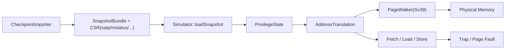

# SPEC06 切片最小 Sv39/MMU 设计

## 背景

当前仓库已经具备：

- 单个 SPEC06 `.zstd` 切片的导入骨架。
- `checkpoint + recipe` 元数据解析。
- `warmup + measure` 窗口执行与结果落盘。
- 对真实 gcc15 SPEC06 切片的前置诊断。

当前真实 blocker 也已经明确：

- 真实切片的 `satp` 非零。
- 切片恢复点依赖虚拟内存地址翻译。
- 仓库当前没有 `satp / page table walk / Sv39 / sfence.vma / 特权级地址翻译` 相关实现。

因此，若希望当前项目直接运行这批 SPEC06 切片，不能只做 checkpoint 导入，必须补齐最小可用的虚拟内存恢复链路。

## 目标

为当前模拟器增加“只服务于 SPEC06 切片恢复与基础 supervisor 测试”的最小 Sv39/MMU 支持，使其能够：

- 从 checkpoint 恢复 `satp` 和相关 CSR 后继续执行。
- 对取指、load、store 执行 Sv39 地址翻译。
- 通过一批最小的 `riscv-tests` supervisor/vm 相关测试。
- 将真实 SPEC06 单切片 smoke 从“导入阶段失败”推进到“进入执行语义验证阶段”。

## 非目标

本阶段不做以下内容：

- 不做完整 Linux 级虚拟内存子系统。
- 不做多核 TLB shootdown。
- 不做复杂缓存一致性与 page walker 并行优化。
- 不做 Sv48/Sv57/Sv64。
- 不做 hypervisor 二阶段翻译。
- 不追求 gem5/NEMU 级 page walk 性能模型。

## 方案比较

### 方案 A：继续绕过 MMU

做法：

- 继续依赖外部转换器，把 checkpoint 变成 paging-off 或物理地址可直接执行的快照。

优点：

- 对当前仓库侵入最小。

缺点：

- 对这批真实 SPEC06 checkpoint 基本不可行。
- 即使外部工具能恢复，也难以稳定导出与当前程序语义一致的“paging-off”状态。
- 项目内部始终无法独立运行真实切片。

结论：

- 不采用。

### 方案 B：一次性实现完整 supervisor/MMU 子系统

做法：

- 直接把 `satp`、特权级、完整 page fault、TLB、复杂异常与系统态语义一次补齐。

优点：

- 最终形态完整。

缺点：

- 范围过大，和当前“先跑通切片”的目标不匹配。
- 风险高，验证周期长。

结论：

- 不采用。

### 方案 C：实现“最小 Sv39 for SPEC slice”，推荐

做法：

- 只补当前切片恢复真正需要的虚拟内存链路。
- 先保证正确性，再考虑性能优化。

优点：

- 与当前真实 blocker 精确对齐。
- 范围可控，便于单测和阶段验收。
- 后续可在此基础上增量扩展 TLB、更多特权语义与更完整 fault 模型。

缺点：

- 第一版性能会一般。
- 后续若要支持更复杂系统态 workload，仍需要继续扩展。

结论：

- 采用方案 C。

## 总体设计

核心思路：

- `Memory` 继续只表示物理内存，不承担页表语义。
- 新增独立地址翻译层，负责 `VA -> PA`。
- CPU 的取指与访存统一先经过翻译层，再访问物理 `Memory`。
- checkpoint 恢复时恢复架构态与 CSR，微架构态仍然不恢复。

## 模块拆分

### 1. PrivilegeState

职责：

- 维护当前特权级 `M/S/U`。
- 提供与 `mstatus/sstatus/satp` 相关的最小访问接口。
- 为地址翻译层提供“当前访问权限上下文”。

本阶段要求：

- 能从 checkpoint CSR 中恢复。
- 能被系统指令和 trap 路径更新。

### 2. AddressTranslation

职责：

- 为 `fetch/load/store` 提供统一翻译入口。
- 根据当前 `satp` 决定：
  - `MODE=0` 时直通。
  - `MODE=Sv39` 时执行 page walk。
- 将失败分类成 instruction/load/store page fault 或 access fault。

建议接口：

- `translateInstructionAddress(va)`
- `translateLoadAddress(va, size)`
- `translateStoreAddress(va, size)`

### 3. Sv39PageWalker

职责：

- 实现 3 级页表遍历。
- 支持 4KiB / 2MiB / 1GiB leaf。
- 校验 `V/R/W/X/U/A/D` 位。
- 为 store 自动置 `D`，为访问自动置 `A`。

约束：

- 第一版不引入 TLB。
- 每次翻译直接走 page walk，先保证正确。

### 4. CPU 访存接入点

需要统一改造三类路径：

- 取指
- load
- store

要求：

- InOrder 与 OOO 共享同一套翻译语义。
- 不允许在两套 CPU 中各自实现一份 Sv39 逻辑。

### 5. Trap / Fault 分类

需要补齐：

- instruction page fault
- load page fault
- store/amo page fault

要求：

- trap 要能回写对应 CSR。
- 失败信息要同时能服务于：
  - `riscv-tests`
  - checkpoint smoke 诊断

### 6. sfence.vma

本阶段职责：

- 若无 TLB，实现可退化为“逻辑存在但实际只作为同步点”。
- 接口上仍然保留，避免后续补 TLB 时重写控制流。

## 恢复语义

checkpoint 恢复阶段至少需要正确恢复这些状态：

- `pc`
- 通用寄存器
- 浮点寄存器
- `satp`
- `mstatus`
- `sstatus`
- `mepc / sepc`
- 其他当前运行路径真正依赖的 CSR

恢复顺序建议：

1. 物理内存
2. GPR/FPR
3. CSR
4. 当前特权态
5. PC

## 验证策略

### 单元测试

优先补以下测试：

- Sv39 page walk 命中 4KiB leaf
- Sv39 page walk 命中 superpage
- `V/R/W/X/U` 权限检查
- `A/D` 位更新
- `satp=0` 直通
- `sfence.vma` 基本语义

### 仓库现有测试扩展

需要新增或扩展：

- checkpoint 恢复带 `satp` 的用例
- 地址翻译失败分类用例
- OOO / InOrder 共用翻译层一致性用例

### riscv-tests

优先级建议：

1. `rv64mi/illegal.S`
   - `satp` / `sfence.vma` 的非法陷入与可访问性
2. `rv64si/dirty.S`
   - A/D 位与 VM 基础行为
3. `rv64si/icache-alias.S`
   - 虚拟地址取指与 `sfence.vma`

后续可扩展：

- `env/v/vm.c` 相关 VM 环境测试

### 真实切片 smoke

以当前真实样例为阶段验收：

- `bzip2_source/555`

阶段目标变化：

1. 当前：导入阶段明确报 `satp` blocker
2. 第一阶段完成后：能恢复并进入执行
3. 第二阶段再看是否会卡在未实现系统态指令或其他 trap

## 分阶段范围

### 阶段 1：最小可运行

- 恢复 `satp` 与特权态
- Sv39 page walk
- fetch/load/store 地址翻译
- 基础 page fault
- `sfence.vma`
- 最小单测 + `rv64mi/rv64si` 子集

验收标准：

- 不再因为 `satp != 0` 在 importer 阶段失败
- 真实 SPEC06 单切片能进入实际执行

### 阶段 2：稳定化

- 完善 trap 细节
- 完善 OOO 与 InOrder 一致性
- 修正真实切片执行中暴露出来的系统态缺口

### 阶段 3：性能优化

- 视需要增加 TLB
- 再考虑 page walk 开销与统计

## 风险

### 风险 1：把 MMU 逻辑散落到 InOrder/OOO 两边

后果：

- 双份实现长期漂移。

规避：

- 地址翻译统一抽象在共享层。

### 风险 2：一开始就追求 TLB/性能模型

后果：

- 范围失控，影响切片恢复主目标。

规避：

- 第一版不做 TLB。

### 风险 3：checkpoint 需要的系统态细节超出最小 Sv39

后果：

- 即使地址翻译打通，仍可能卡在其他 supervisor 指令或 trap 语义。

规避：

- 把真实切片 smoke 放进阶段验收，尽早暴露下一层 blocker。

## 结论

要直接运行当前这批 gcc15 SPEC06 切片，最现实的路径不是继续寻找绕过方案，而是补齐“最小 Sv39/MMU 支持”。

实现重点不是做完整 OS 子系统，而是：

- 正确恢复 `satp`
- 正确进行 Sv39 地址翻译
- 统一接入取指与访存
- 用 `riscv-tests + 真实切片 smoke` 双重验证

这条路径工作量中等偏大，但范围可收敛，且与当前 blocker 精确对齐。
