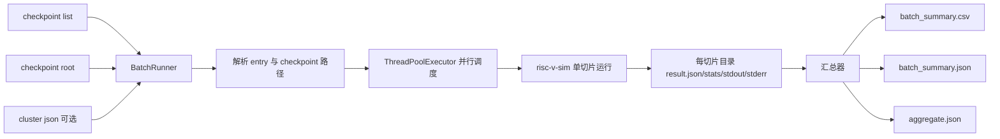

# SPEC06 Parallel Batch Runner Design

## 背景

当前仓库已经能稳定运行单个 SPEC06 checkpoint 切片，并产出：

- `stats.txt`
- `result.json`
- `summary.csv`
- `completed` / `abort`

下一阶段目标不是继续往 `risc-v-sim` 主 CLI 堆调度逻辑，而是在其上增加一个轻量批跑器，支持：

- 读取 `checkpoint.lst` / `spec06_0.3c.lst`
- 并行启动多个切片
- 为每个切片保留独立输出目录与 stdout/stderr
- 在批次根目录生成汇总 CSV/JSON
- 可选读取 `cluster-0-0.json` 或 `gcc15-spec06-0.3.json` 做轻量加权汇总

## 目标

第一版批跑器必须满足：

- 输入 GEM5 风格的 list 文件，至少消费前两列：
  - `entry_name`
  - `workload/slice_id`
- 根据 `checkpoint_root` 自动解析出真实 `.zstd` checkpoint 路径
- 通过多进程并行运行现有 `risc-v-sim --checkpoint=...` 单切片链路
- 每个切片输出到独立目录，目录名默认使用 list 第一列
- 每个切片额外保留：
  - `stdout.log`
  - `stderr.log`
  - `command.txt`
- 批次根目录生成：
  - `batch_summary.csv`
  - `batch_summary.json`
  - `aggregate.json`

## 非目标

第一版不做：

- 复刻 GEM5 的完整 score 脚本
- 复用 list 后四列 warmup/measure 配置
- 在主模拟器二进制中内建批调度器
- 分布式调度或跨机器执行

## 方案选择

### 方案 A：扩展 `risc-v-sim` 主 CLI

- 优点：所有入口都在一个二进制里
- 缺点：主 CLI 会混入批调度、文件扫描、并发控制、汇总逻辑，边界变差

### 方案 B：独立 Python 批跑脚本，推荐

- 优点：直接复用稳定的单切片 runner；并发、日志、汇总更适合脚本层
- 优点：后续扩展到 `0.3c / 0.8c / 1.0c` 只需更换输入 list
- 缺点：多一个工具入口

### 方案 C：Shell + GNU Parallel

- 优点：实现最快
- 缺点：跨平台和错误处理差，汇总逻辑脆弱，测试困难

结论：采用 **方案 B**。

## 数据流



## 输入契约

命令示例：

```bash
python3 tools/benchmarks/run_checkpoint_batch.py \
  --simulator ./build/risc-v-sim \
  --checkpoint-list /nfs/home/share/gem5_ci/spec06_cpts/gcc15/spec06_0.3c.lst \
  --checkpoint-root /nfs/home/share/checkpoints_profiles/spec06_gcc15_rv64gcb_base_260122/checkpoint-0-0-0 \
  --output-dir /tmp/spec06-gcc15-0.3c \
  --jobs 32 \
  --warmup-instructions 5000000 \
  --measure-instructions 5000000 \
  --cpu-mode in-order \
  --cluster-config /nfs/home/share/gem5_ci/spec06_cpts/gcc15/gcc15-spec06-0.3.json
```

第一版 CLI 选项：

- `--simulator`
- `--checkpoint-list`
- `--checkpoint-root`
- `--output-dir`
- `--jobs`
- `--warmup-instructions`
- `--measure-instructions`
- `--cpu-mode in-order|ooo`
- `--cluster-config`
- `--checkpoint-importer`
- `--checkpoint-restorer`
- `--checkpoint-recipe`
- `--specific-benchmarks`
- `--extra-sim-arg`（可重复）

## 解析规则

- list 文件按空白分列
- 忽略空行和 `#` 注释
- 第一列作为 `entry_name`
- 第二列作为 `workload_name/slice_id`
- checkpoint 文件路径解析规则：
  - `checkpoint_root / 第二列 / *.zstd`
  - 若匹配 0 个或超过 1 个，视为该条目失败

## 输出结构

```text
output_dir/
  batch_summary.csv
  batch_summary.json
  aggregate.json
  <entry_name>/
    command.txt
    stdout.log
    stderr.log
    stats.txt
    result.json
    summary.csv
    completed | abort
    error.txt
```

## 汇总规则

`batch_summary.csv/json` 每行至少包含：

- `entry_name`
- `workload_name`
- `slice_id`
- `checkpoint_path`
- `status`
- `success`
- `failure_reason`
- `instructions_measure`
- `cycles_measure`
- `ipc_measure`
- `weight`
- `output_dir`

`aggregate.json` 至少包含：

- `total`
- `success_count`
- `failure_count`
- `success_rate`
- `total_instructions_measure`
- `total_cycles_measure`
- `aggregate_ipc_by_sum`
- `weighted_ipc`
- `failed_entries`

其中：

- `aggregate_ipc_by_sum = sum(instructions_measure) / sum(cycles_measure)`
- `weighted_ipc` 优先使用 `cluster_config` 中对应 benchmark/point 的权重
- 若未提供 `cluster_config`，回退到单切片 `result.json.weight`

## 失败语义

单切片失败不应导致整个批次立即停止。批跑器应：

- 继续跑完其他切片
- 将当前条目标记为失败
- 在 `aggregate.json` 中列出失败条目与原因
- 仅当存在任一失败时，以非零退出码结束批次脚本

## 验证

需要三层验证：

1. 解析/汇总单元测试
2. 用 fake simulator 脚本验证批跑器并发、日志和汇总输出
3. 真实 SPEC06 小批量 smoke
   - 先跑 `spec06_0.3c.lst` 中 3-5 个切片
   - 再用更大 `jobs` 跑更多切片
