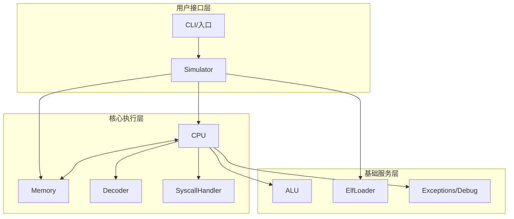
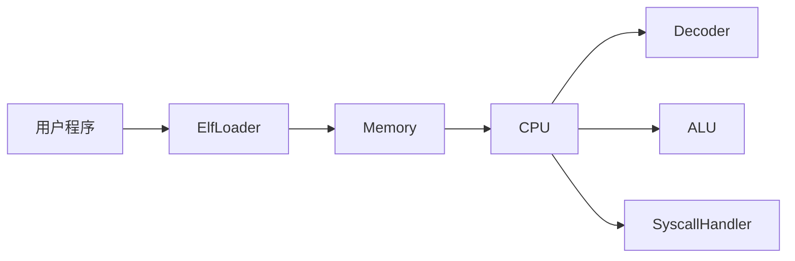
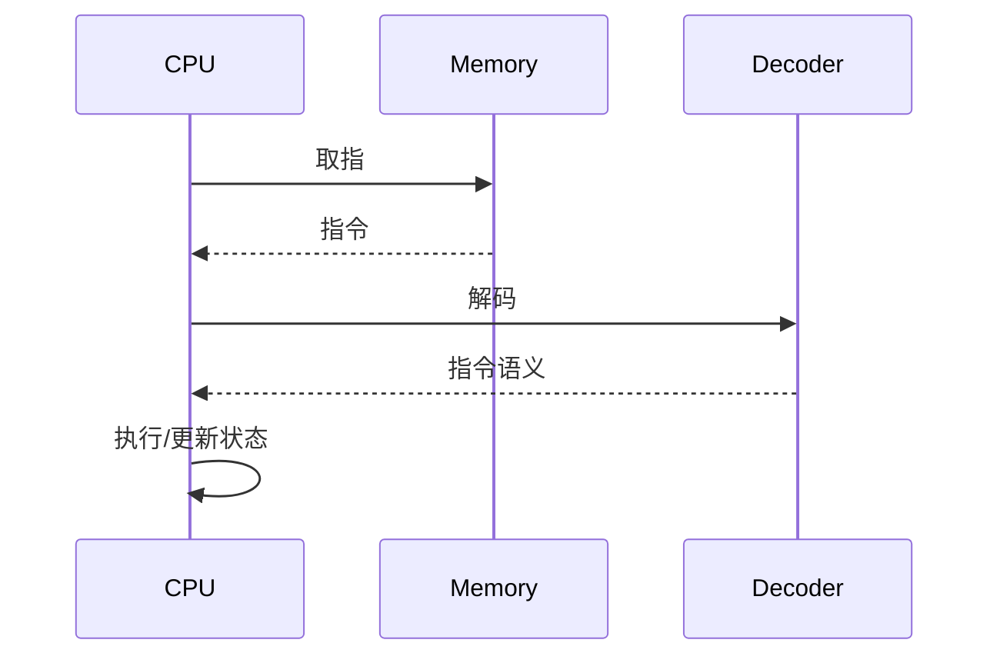
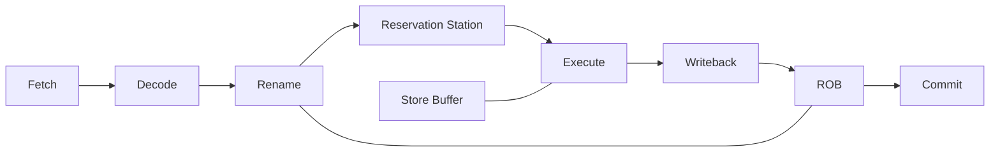

# RISC-V 模拟器架构文档（精简版）

本文档强调“为什么这样设计”，避免实现细节与代码片段。适合作为回顾与继续演进的入口。

## 目标与范围
- 说明整体架构、关键模块职责与核心数据流
- 记录关键设计取舍（ADR 风格）
- 为新增指令扩展与测试策略提供框架

## 架构原则
- 模块化分层，职责单一，接口清晰
- 兼顾可扩展性（指令扩展、CPU 模式）与可测试性
- 主路径清晰：加载 → 取指 → 译码 → 执行 → 提交/退出

## 总体结构（分层）

## 关键模块职责
- `Simulator`: 统一入口，生命周期管理（加载/运行/重置）与组件协调
- `CPU`: 执行引擎与状态管理，分为 In-Order 与 OOO 两套实现
- `Memory`: 线性地址空间与访问边界管理，提供指令与数据访问能力
- `Decoder`: 指令格式识别与字段提取，包含 C 扩展的透明解码
- `SyscallHandler`: 处理 ECALL 与最小系统调用集合（适配测试集）
- `ElfLoader`: ELF 解析与内存映射，完成程序加载与入口点设置
- `ALU`: 算术/逻辑/移位/比较的统一执行能力
- `Exceptions/Debug`: 统一错误处理与执行状态观测

## 关键数据流

## 乱序执行（OOO）结构概览

## 关键设计决策（ADR 摘要）
- 双 CPU 模式（In-Order + OOO）
  动机：兼顾易调试与性能探索；代价是维护成本上升
- 线性内存模型
  动机：简化地址空间与测试；代价是不支持复杂虚拟内存
- Decoder 处理压缩指令
  动机：对 CPU 执行层透明，减少执行路径复杂度；代价是解码层复杂度略升
- 采用 ELF Loader
  动机：与工具链/测试集对齐，方便加载标准程序；代价是实现 ELF 解析逻辑
- Syscall 最小集合
  动机：满足 riscv-tests 与示例程序；代价是通用性有限

## 扩展与演进路径
- 新指令扩展优先保证：识别（Decoder）→ 执行（CPU/ALU）→ 约束（验证）→ 测试
- OOO 扩展优先保证：提交一致性、异常恢复与存储顺序语义

## 测试策略（框架级）
- 单元测试：核心组件与边界条件
- 集成测试：完整程序执行路径
- ISA 测试：riscv-tests 子集验证
