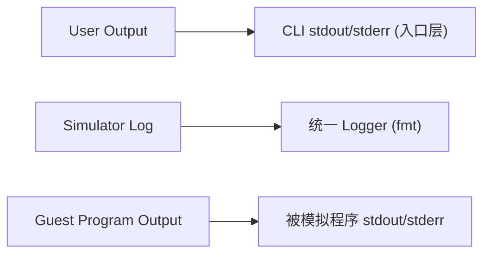

# 日志系统统一方案（RFC，精简版）

## 1. 目标
- 统一日志入口，消除 `stdout` / `LOG_DEBUG` / `dprintf` 混用。
- 保持 GEM5 风格可读性：高频日志默认只看 `category + cycle`。
- 统一为 `fmt` 格式化，跨 macOS / Linux 一致。
- 运行时日志默认 English + ASCII，避免终端编码问题。

## 2. 非目标
- 本文不改执行语义，不调整 CPU 流水线行为。
- 本文不引入复杂异步日志框架（先保持 KISS）。

## 3. 日志分层


- `User Output`：给用户看的结果/帮助信息，只允许在入口层（如 `main`）输出。
- `Simulator Log`：模拟器内部诊断日志，统一走 Logger。
- `Guest Program Output`：被模拟程序自己的输出，语义上不属于调试日志。

## 4. 统一格式（最小头 + 按需上下文）

### 4.1 高频 Trace（默认）
- 格式：`[CAT][c=<cycle>] message [k=v ...]`
- 说明：不强制 `level`，不强制 `pc/inst_id`。

示例：
```text
[FETCH][c=1024] enqueue inst=0x00000013 pc=0x80000000
[RS][c=1025] dispatch rob=12 fu=ALU src1_ready=1 src2_ready=0
```

### 4.2 事件 Event（低频重要）
- 格式：`[LEVEL][CAT][c=<cycle>] message [k=v ...]`
- 说明：`WARN/ERROR/FATAL` 必须带 `LEVEL`。

示例：
```text
[WARN][MEM][c=88] unaligned load addr=0x80000003 size=4
[ERROR][DIFF][c=901] register mismatch reg=x10 ref=0x1 dut=0x0
```

## 5. 字段策略
- 必选：`CAT`、`cycle`（若不可用则 `c=-`）。
- 可选：`pc`、`inst_id`、`rob`、`rs`、`addr`、`opcode` 等上下文字段。
- 原则：只输出“该模块天然可得且对定位有价值”的字段，不全局强制。

## 6. 编码与文案
- 运行日志统一 English + ASCII。
- 文档/注释可保留中文。
- 禁止在日志里混入 emoji、全角符号和本地化文案。

## 7. API 约束（建议）
- 保留一套统一宏/API，例如：
  - `LOGT(cat, "...")`（Trace）
  - `LOGI(cat, "...")` / `LOGW(cat, "...")` / `LOGE(cat, "...")`
- 模块代码禁止直接 `std::cout/std::cerr`（入口层和 guest 输出桥接层除外）。
- `dprintf/LOG_DEBUG` 先做兼容封装，后续逐步下线。

## 8. 迁移顺序
1. 新增统一 Logger（底层 `fmt`），先不改业务逻辑。
2. OOO stages + `Simulator` 先迁移（日志量最大）。
3. `Memory` / `SyscallHandler` 迁移并区分 guest 输出与诊断日志。
4. 清理旧接口，加入 lint/CI 检查（禁止新增直接 `cout/cerr`）。

## 9. 验收标准
- 新增代码不再直接调用 `std::cout/std::cerr`（入口层除外）。
- 同一事件只走一套日志接口，不重复打印。
- 关键场景可仅靠 `CAT + cycle` 追踪；需要时可打开 `pc/inst_id` 上下文。
- macOS 与 Linux 下日志内容一致、无乱码。
